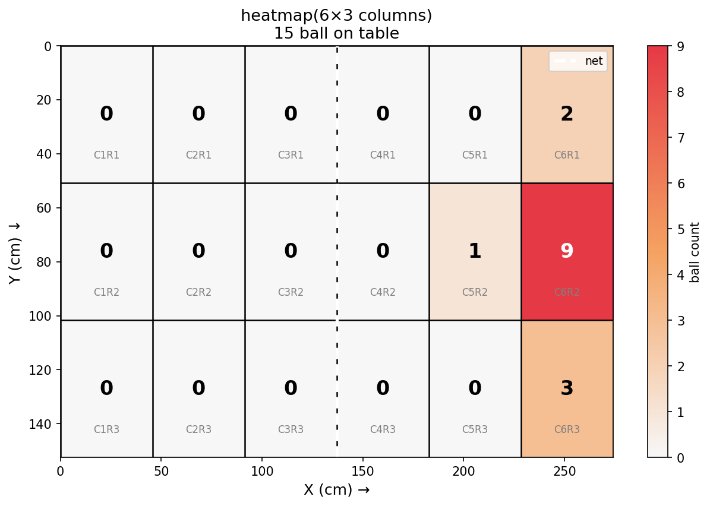
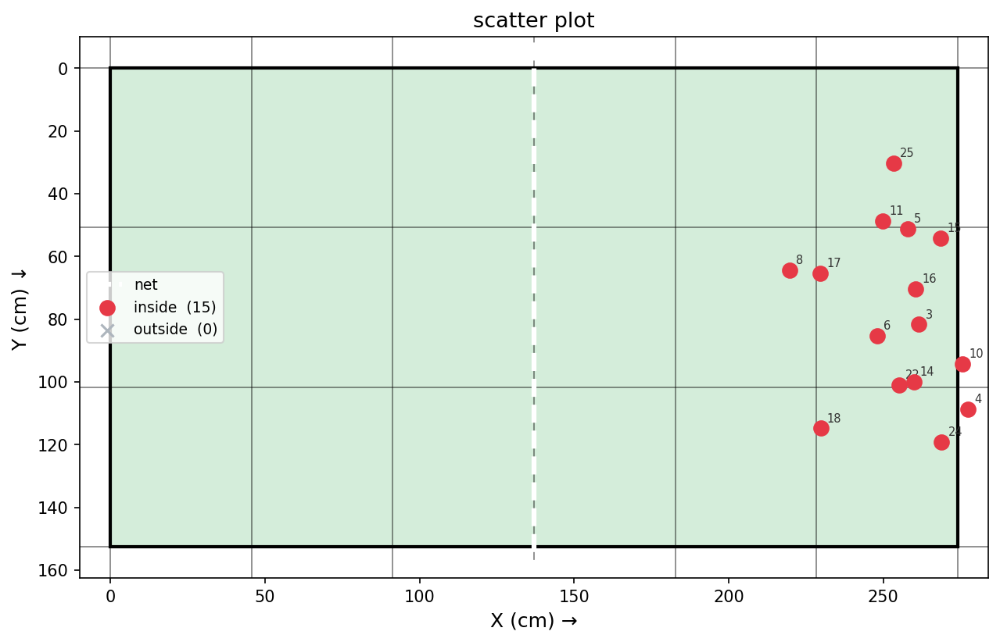
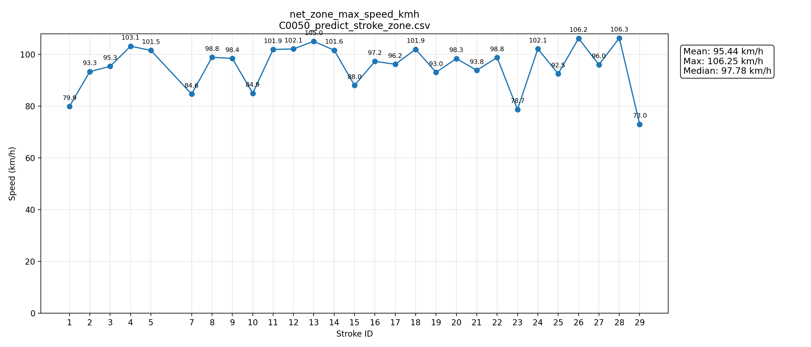

# Speed Analysis

`speed_analysis/` 主要負責把 TrackNetV3 輸出的球軌跡 CSV，進一步整理成 stroke、網前速度、落點區域、落點圖表與視覺化影片。

目前這套流程是針對固定視角的桌球影片設計，主要假設球由畫面左側往右側移動。若更換拍攝角度、球桌位置、桌面顏色或擊球方向，可能需要重新調整 helper table、net zone 與 stroke 判斷參數。

---

## 主要檔案

| 檔案 | 功能 |
|---|---|
| `stroke_zone_analysis.py` | 主流程。讀取 ball CSV、helper table JSON，切分 stroke、計算 net zone 速度、合併落點分析，並可選擇輸出視覺化影片。 |
| `stroke_analysis.py` | stroke 切分與基本繪圖 helper。主要負責從連續可見球軌跡中找出每一次可能的擊球區段。 |
| `bounce_landing_analysis.py` | bounce / landing 分析。根據每個 stroke 的軌跡與桌面座標，找出 bounce frame，轉換成桌面公分座標，並輸出落點圖與統計。 |
| `helper_table.py` | 輔助建立球桌四點與 near-net box。主流程會讀取它輸出的 `*_helper_table.json`。 |
| `plot_speed.py` | 將 `stroke_zone.csv` 中的速度欄位畫成折線圖。 |

---

## 輸入資料

主流程需要以下資料：

```txt
*_ball.csv 或 *_bass.csv
*_helper_table.json
原始影片或 *_predict.mp4（可選，只有輸出視覺化影片時需要）
```

`*_ball.csv` 至少需要包含：

| 欄位 | 說明 |
|---|---|
| `Frame` | frame 編號 |
| `Visibility` | 球是否有效，`1` 代表有偵測到球 |
| `X` | 球心 x 座標 |
| `Y` | 球心 y 座標 |

`*_helper_table.json` 需要先由 `helper_table.py` 建立。主流程不再自動偵測球桌，而是固定讀取 helper table 的結果，這樣可以避免每支影片 table / net zone 偵測不穩造成後續速度與落點偏移。

---

## 執行方式

### 1. 單一 CSV 分析

如果只要輸出 CSV 與落點圖，不需要影片：

```bash
python speed_analysis/stroke_zone_analysis.py --ball_csv path/to/C0086_ball.csv --save_dir path/to/output_dir --helper_table_json path/to/C0086_helper_table.json
```

### 2. 單一影片分析，並輸出視覺化影片

```bash
python speed_analysis/stroke_zone_analysis.py --video_file path/to/C0086.MP4 --ball_csv path/to/C0086_ball.csv --save_dir path/to/output_dir --helper_table_json path/to/C0086_helper_table.json --save_video
```

如果 GPU / FFmpeg 不支援 NVENC，可以改用 CPU 編碼：

```bash
python speed_analysis/stroke_zone_analysis.py --video_file path/to/C0086.MP4 --ball_csv path/to/C0086_ball.csv --save_dir path/to/output_dir --helper_table_json path/to/C0086_helper_table.json --save_video --video_codec libx264
```

### 3. 批次分析

```bash
python speed_analysis/stroke_zone_analysis.py --video_root path/to/original_video_root --save_root path/to/pred_result_root
```

批次模式會在 `save_root` 底下尋找：

```txt
*_ball.csv
*_bass.csv
```

並在同一個資料夾尋找對應的：

```txt
*_helper_table.json
```

若要批次輸出視覺化影片：

```bash
python speed_analysis/stroke_zone_analysis.py --video_root path/to/original_video_root --save_root path/to/pred_result_root --save_video
```

說明：

- `video_root`：原始影片所在資料夾，用來找對應 MP4。
- `save_root`：TrackNetV3 預測結果所在資料夾，用來找 `*_ball.csv` 與 `*_helper_table.json`。
- 沒有影片也可以跑 CSV-only 模式，但不能輸出視覺化影片。

---

## Stroke 切分邏輯

`stroke_analysis.py` 會先找出連續 `Visibility = 1` 的球軌跡區段，再從每個連續區段中判斷是否形成 stroke。

目前主要是針對左到右擊球：

1. 找出一段穩定往左移動的軌跡，作為 stroke start。
2. 檢查後續是否出現往右移動，並且球有到達畫面右側。
3. 若有形成左到右移動，標記為有效 stroke。
4. 若沒有形成有效左到右擊球，但區段長度足夠，保留為 `no_hit`。
5. 若軌跡中出現過大的跳點，stroke 會提前結束，避免把錯誤追蹤點接在同一球內。

目前 `stroke_analysis.py` 本身不負責找 `bounce_frame`，`bounce_frame` 會由 `bounce_landing_analysis.py` 後續補上。

常見欄位：

| 欄位 | 說明 |
|---|---|
| `stroke_id` | stroke 編號 |
| `frame_start` | stroke 起始 frame |
| `frame_end` | stroke 結束 frame |
| `bounce_frame` | bounce frame，若沒有偵測到則為 `0` |
| `valid` | 是否為有效 stroke |
| `note` | 額外註記，例如 `no_hit`、`net_stop`、`no_clean_speed_segment` |

---

## Helper Table 與 Net Zone

目前主流程使用 `helper_table.py` 輸出的 `*_helper_table.json` 來取得球桌四個角點。

helper table 點選順序為：

```txt
LF -> RF -> RB -> LB
左前 -> 右前 -> 右後 -> 左後
```

主流程會轉換成桌面座標使用的順序：

```txt
LB -> RB -> RF -> LF
左後 -> 右後 -> 右前 -> 左前
```

桌面座標定義為：

```txt
LB = (0, 0)
RB = (274, 0)
RF = (274, 152.5)
LF = (0, 152.5)
```

程式也會使用 helper table 建立 near-net box。這個 near-net box 會保留 helper table 原始的 8 個投影點，不再轉成舊版的 6 點 polygon。輸出時會寫入：

```txt
net_p1_x, net_p1_y ... net_p8_x, net_p8_y
```

視覺化影片中，藍色區域是桌面四點，黃色框是 near-net box。

---

## Net Zone Speed

目前主要速度指標是：

```txt
net_zone_max_speed_kmh
```

它代表球通過 near-net box 附近時的最大合理速度。這個指標比整段 stroke 的最大速度更穩定，因為它比較不容易被遠端錯誤追蹤點影響。

### 速度計算方式

球桌尺寸：

```txt
TABLE_W = 274.0 cm
TABLE_H = 152.5 cm
```

程式會根據球桌四點估算：

| 參數 | 說明 |
|---|---|
| `sx_cm_per_px` | 長邊方向的 cm / pixel 比例 |
| `sy_cm_per_px` | 短邊方向的 cm / pixel 比例 |

實際速度換算使用混合比例：

```txt
scale = sx + 0.25 * (sy - sx)
```

速度公式：

```txt
distance_cm = sqrt(dx_cm^2 + dy_cm^2)
time_sec = frame_gap / fps
speed_kmh = distance_cm / time_sec * 0.036
```

其中 `0.036` 是從 `cm/s` 轉成 `km/h` 的係數。

### 速度候選

每個 frame 會嘗試三種速度段：

| 類型 | 說明 |
|---|---|
| `1f` | 使用相鄰 1 frame 的位移 |
| `2f` | 使用間隔 2 frame 的位移 |
| `c2f` | 使用前後各 1 frame 的 centered 2-frame 位移 |

每個 frame 會取合理速度候選中的最大值。速度段只保留向右移動的區段，也就是 `x2 > x1`。

目前速度上限為：

```txt
MAX_SPEED_KMH = 115.0
```

超過這個值會被排除，避免錯誤追蹤點造成速度爆高。

---

## Bounce / Landing 分析

`bounce_landing_analysis.py` 會針對每個有效 stroke，在 stroke 軌跡中尋找 bounce frame。

目前 bounce 判斷不是單純找最低點，而是使用 image-space 的 Y 軌跡變化與局部 piecewise 規則：

1. 先把 stroke 內的可見球點投影到桌面平面，取得 `(x_cm, y_cm)`。
2. 投影座標主要用來判斷是否接近桌面、是否在右半桌，以及計算最後落點座標。
3. bounce 是否成立，主要看影像座標中的 Y 方向變化。
4. 一般 bounce 會要求落點附近呈現下降後上升的 V 形變化。
5. 若球在 stroke 尾端才落地，會使用 terminal / flat rebound 規則補足沒有明顯反彈的情況。

目前只分析右半桌落點：

```txt
RIGHT_HALF_ONLY = True
```

也就是投影後的 `x_cm` 需要在網子右側附近，才會被視為目標落點。

### 落點座標

落點會使用 homography 轉換成桌面公分座標：

```python
cv2.findHomography()
cv2.perspectiveTransform()
```

輸出座標：

| 欄位 | 說明 |
|---|---|
| `ball_px` | bounce frame 的球心 x 像素座標 |
| `ball_py` | bounce frame 的球心 y 像素座標 |
| `x_cm` | 投影到桌面後的 x 公分座標 |
| `y_cm` | 投影到桌面後的 y 公分座標 |

### 落點區域

桌面會切成：

```txt
6 columns × 3 rows = 18 zones
```

zone label 格式為：

```txt
C1R1 ~ C6R3
```

例如 `C6R2` 代表第 6 欄、第 2 列。

---

## 輸出檔案

執行 `stroke_zone_analysis.py` 後，常見輸出如下：

| 檔案 | 說明 |
|---|---|
| `xxx_stroke_zone.csv` | 最主要的乾淨結果，包含 stroke frame、bounce frame、net zone max speed、落點 zone、valid 與 note。 |
| `xxx_zone_detail.csv` | 每個 stroke 使用的 table corners 與 near-net box 8 點座標。 |
| `xxx_net_zone_speed_detail.csv` | 速度細節，包含 `1f`、`2f`、`c2f`、速度段 frame、sx/sy 比例。 |
| `landing_detail.csv` | landing 詳細資料，包含 bounce 座標、投影座標、zone、bounce_type 與判斷用數值。 |
| `zone_stats.csv` | 每個落點區域的統計數量。 |
| `landing_heatmap.png` | 落點熱力圖。 |
| `landing_zones.png` | 落點散佈圖。 |
| `xxx_stroke_zone_visualize.mp4` | 視覺化影片，只有加上 `--save_video` 且找到影片時才會輸出。 |

### `landing_heatmap.png` — 落點熱力圖



### `landing_zones.png` — 落點散佈圖



### `xxx_stroke_zone.csv` 主要欄位

| 欄位 | 說明 |
|---|---|
| `stroke_id` | stroke 編號 |
| `frame_start` | stroke 起始 frame |
| `frame_end` | stroke 結束 frame |
| `bounce_frame` | 偵測到的 bounce frame，沒有則為 `0` |
| `net_zone_max_speed_kmh` | near-net box 附近最大速度 |
| `net_zone_max_speed_type` | 該速度來自 `1f`、`2f` 或 `c2f` |
| `net_zone_max_speed_start_frame` | 最大速度段起始 frame |
| `net_zone_max_speed_end_frame` | 最大速度段結束 frame |
| `zone_label` | 落點區域，例如 `C6R2` |
| `in_table` | 是否落在桌面範圍內 |
| `valid` | 是否為有效 stroke |
| `note` | 額外註記 |

---

## 視覺化影片

若有加上 `--save_video`，會輸出：

```txt
xxx_stroke_zone_visualize.mp4
```

影片中會畫出：

- 目前 frame 編號
- 球的位置
- stroke 軌跡
- stroke start / bounce / end
- table polygon
- near-net box
- stroke 是否 valid
- note 註記

如果沒有提供影片，或找不到對應 MP4，程式仍然可以輸出 CSV 與落點圖，但會略過視覺化影片。

---

## 速度折線圖

如果想把速度結果畫成折線圖，可以使用：

```bash
python speed_analysis/plot_speed.py --input path/to/xxx_stroke_zone.csv
```

預設建議畫：

```txt
net_zone_max_speed_kmh
```

也可以指定其他欄位：

```bash
python speed_analysis/plot_speed.py --input path/to/xxx_stroke_zone.csv --speed net_zone_max_speed_kmh
```

也可以輸入資料夾，讓程式自動找底下所有 `*_stroke_zone.csv`。

```bash
python speed_analysis/plot_speed.py --input path/to/folder
```



---

## 可調整參數

### `stroke_zone_analysis.py` CLI 參數

| 參數 | 預設值 | 作用 |
|---|---:|---|
| `--min_left_segments` | `5` | stroke start 前至少需要幾段穩定往左移動。 |
| `--min_candidate_frames` | `50` | 有效 stroke 至少需要的 frame 長度。 |
| `--min_no_hit_candidate_frames` | `20` | no_hit 候選至少需要的 frame 長度。 |
| `--max_step_th` | `300.0` | 相鄰 frame 最大允許位移，超過會視為跳點。 |
| `--max_abs_dy_th` | `45.0` | 找左移段時，y 方向允許的最大變化。 |
| `--left_half_ratio` | `0.35` | 短 no_hit 若結束位置超過此畫面比例，會被過濾。 |
| `--right_side_ratio` | `0.5` | 有效 stroke 需要到達的右側畫面比例。 |
| `--fps` | `120.0` | CSV-only 模式使用的 FPS。若有影片，會以影片 FPS 為主。 |
| `--frame_w` | `1920` | CSV-only 模式使用的畫面寬度。 |
| `--frame_h` | `1080` | CSV-only 模式使用的畫面高度。 |
| `--near_dist` | `helper_table.py` 預設 | near-net box 的距離設定。 |
| `--box_height` | `helper_table.py` 預設 | near-net box 的高度設定。 |
| `--save_video` | 關閉 | 是否輸出視覺化影片。 |
| `--video_codec` | `h264_nvenc` | 影片編碼，可改成 `libx264`。 |

### 速度相關固定值

| 參數 | 值 | 說明 |
|---|---:|---|
| `TABLE_W` | `274.0` | 桌球桌長度，單位 cm。 |
| `TABLE_H` | `152.5` | 桌球桌寬度，單位 cm。 |
| `MAX_SPEED_KMH` | `115.0` | 速度上限，用來排除明顯錯誤追蹤點。 |
| `scale = sx + 0.25 * (sy - sx)` | `0.25` | x/y 比例混合係數。 |

### Bounce / Landing 相關值

| 參數 | 值 | 說明 |
|---|---:|---|
| `TABLE_MARGIN_X_CM` | `10.0` | 判斷落點是否接近桌面時，x 方向容許誤差。 |
| `TABLE_MARGIN_Y_CM` | `15.0` | 判斷落點是否接近桌面時，y 方向容許誤差。 |
| `RIGHT_HALF_ONLY` | `True` | 只保留右半桌落點。 |
| `FIT_WINDOW` | `6` | bounce 局部線性檢查的最大窗口。 |
| `MIN_PRE_POINTS` | `3` | bounce 前至少需要的點數。 |
| `MIN_POST_POINTS` | `2` | bounce 後至少需要的點數。 |
| `MAX_FRAME_GAP_IN_FIT` | `4` | 局部檢查允許的最大 frame gap。 |

---

## 常見 note 說明

| note | 說明 |
|---|---|
| `no_hit` | 該段軌跡沒有形成有效左到右擊球。 |
| `net_stop` | stroke 結束點落在 near-net box 內，可能是打到網或停在網前。 |
| `no_clean_speed_segment` | 找不到可用的合理速度段。 |
| `no_ball_in_net_zone` | stroke 有效，但球沒有進入 near-net box，因此沒有 net zone speed。 |
| `no_video_or_table_geometry` | 缺少影片資訊或 table / net 幾何資訊。 |

---

## 目前限制

1. **主要適用左到右擊球**  
   stroke 判斷與速度段篩選目前都以 `x` 增加為主要方向，如果影片是右到左，需要修改判斷條件。

2. **速度是 2D 估計**  
   速度是用球在影像中的 2D 位移加上桌面比例估計，沒有估計球的真實 3D 高度，因此球離桌面越高，誤差可能越明顯。

3. **落點依賴 helper table 準確度**  
   如果四個桌角點錯，homography 轉換後的 `(x_cm, y_cm)` 也會偏。

4. **bounce detection 仍受軌跡品質影響**  
   如果 TrackNetV3 偵測錯球、漏球，或 inpaint 補點不準，bounce frame 可能會被漏掉或抓錯。

5. **near-net box 是針對目前場景調整**  
   若鏡頭角度、球桌位置或球的通過位置改變，可能需要重新調整 `near_dist` 與 `box_height`。

6. **`MAX_SPEED_KMH` 是人工過濾上限**  
   這個值是為了排除錯誤追蹤造成的異常速度，不代表真實球速一定不會超過此值。

---

## 建議檢查流程

每次換新影片或新資料夾時，建議先照這個順序檢查：

1. 先確認 `*_ball.csv` 的球軌跡是否合理。
2. 用 `helper_table.py` 建立並檢查 `*_helper_table.json`。
3. 先跑一次不加 `--save_video` 的分析，確認 CSV 是否能正常輸出。
4. 再加上 `--save_video` 輸出視覺化影片。
5. 用視覺化影片檢查 table、near-net box、stroke 軌跡與 bounce 是否合理。
6. 最後再看 `stroke_zone.csv`、`landing_detail.csv`、`landing_heatmap.png` 與速度折線圖。
